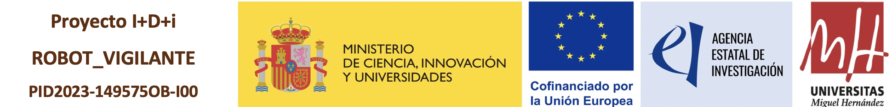

<div align="center">
<h1> A Coarse to Fine 3D LiDAR Localization with Deep Local Features for Long Term Robot Navigation in Large Environments </h1>
<h3>M. Máximo, A. Santo, A. Gil, M. Ballesta, D. Valiente
</div>

<div align="justify">
[Paper](https://onlinelibrary.wiley.com/doi/10.1155/int/4278222)
### Abstract
The location of a robot is a key aspect in the field of mobile robotics. This problem is particularly complex when the initial pose of the robot is unknown. In order to find a solution, it is necessary to perform a global localization. In this paper, we propose a method that addresses this problem using a coarse‐to‐fine solution. The coarse localization relies on a probabilistic approach of the Monte Carlo Localization (MCL) method, with the contribution of a robust deep learning model, the MinkUNeXt neural network, to produce a robust description of point clouds of a 3D LiDAR within the observation model. The MCL method has been approached from a topological perspective, considering that the particles are initialized on the map positions where LiDAR scans have been previously captured. For fine localization, global point cloud registration has been implemented. MinkUNeXt aids this by exploiting the outputs of its intermediate layers to produce deep local features for each point in a scan. These features facilitate precise alignment between the current sensor observation (query) and one of the point clouds on the map. The proposed MCL method incorporating Deep Local Features for fine localization is termed MCL‐DLF. Alternatively, a classical ICP method has been implemented for this precise localization aiming at comparison purposes. This method is termed MCL‐ICP. In order to validate the performance of MCL‐DLF method, it has been tested on publicly available datasets such as the NCLT dataset, which provides seasonal large‐scale environments. Additionally, tests have been also performed with own data (UMH) that also includes seasonal variations on large indoor/outdoor scenarios. The results, which were compared with established state‐of‐the‐art methodologies, demonstrate that the MCL‐DLF method obtains an accurate estimate of the robot localization in dynamic environments despite changes in environmental conditions.


### Datasets
The University of Michigan North Campus Long-Term Vision and LIDAR (NCLT) Dataset can be found at https://robots.engin.umich.edu/nclt/

ARVC Dataset can be found at https://arvc.umh.es/db/databases/

### Citation
```
@article{https://doi.org/10.1155/int/4278222,
author = {Máximo, Míriam and Santo, Antonio and Gil, Arturo and Ballesta, Mónica and Valiente, David},
title = {A Coarse-to-Fine 3D LiDAR Localization With Deep Local Features for Long-Term Robot Navigation in Large Environments},
journal = {International Journal of Intelligent Systems},
volume = {2026},
number = {1},
pages = {4278222},
keywords = {3D deep learning, feature descriptor, fine localization, global localization, light detection and ranging (LiDAR), point cloud, pose estimation},
doi = {https://doi.org/10.1155/int/4278222},
url = {https://onlinelibrary.wiley.com/doi/abs/10.1155/int/4278222},
eprint = {https://onlinelibrary.wiley.com/doi/pdf/10.1155/int/4278222},
year = {2026}
}
```

### Acknowledgments
This research work is part of the project PID2023-149575 OB-I00 funded by MICIUAEI and by FEDER, UE. Furthermore, it is part of the project CIPROM/2024/8, funded by Generalitat Valenciana, Conselleria de Educación, Cultura, Universidades y Empleo (program PROMETEO 2025).



</div>
